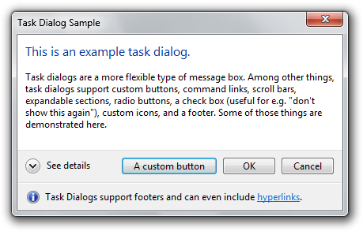
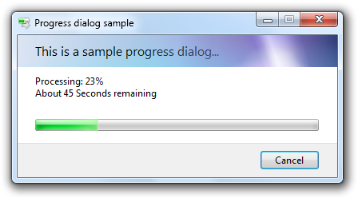
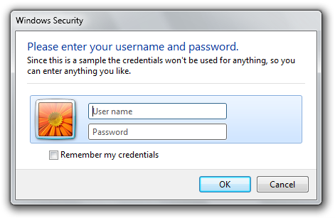
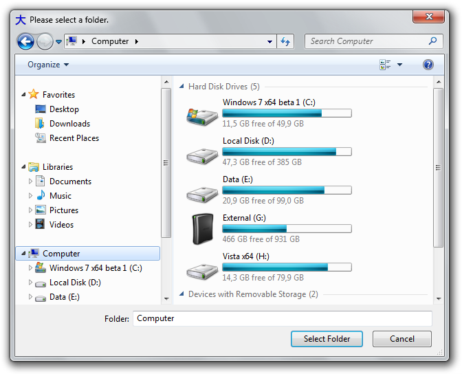

# Ookii.Dialogs.Wpf [](https://www.nuget.org/packages/Ookii.Dialogs.Wpf/)

## Overview

**Ookii.Dialogs.Wpf.NETCore** is a class library for .NET Core applications providing several common dialogs. Included are classes for task dialogs, credential dialogs, progress dialogs, and common file dialogs.

### Getting started

Install the [Ookii.Dialogs.Wpf](https://www.nuget.org/packages/Ookii.Dialogs.Wpf/) package from NuGet:

```powershell
Install-Package Ookii.Dialogs.Wpf.NETCore
```

The included sample application [`Ookii.Dialogs.Wpf.Sample`](sample/Ookii.Dialogs.Wpf.Sample/) demonstrate the dialogs for WPF. View the source of this application to see how to use the dialogs.

N.B.: **Ookii.Dialogs.Wpf** requires the [.NET Core 3](https://www.microsoft.com/en-us/download/details.aspx?id=30653). The included source code is intended for use in Visual Studio.

### Windows Forms compatibility

If you're looking to use these common dialogs on a Windows Forms application, check out [Ookii.Dialogs.WinForms](https://github.com/caioproiete/ookii-dialogs-winforms).

## Included dialogs

### Task dialog

[Task dialogs](https://docs.microsoft.com/en-us/windows/desktop/Controls/task-dialogs-overview) are a new type of dialog first introduced in Windows Vista. They provide a superset of the message box functionality.



The `Ookii.Dialogs.Wpf.TaskDialog` class provide access to the task dialog functionality. The `TaskDialog` class inherits from `System.ComponentModel.Component` and offers full support for the Component designer of Visual Studio.

The `TaskDialog` class requires Windows Vista or a later version of Windows. Windows XP is not supported. Note that it is safe to instantiate the `TaskDialog` class and set any of its properties; only when the dialog is shown will a `NotSupportedException` be thrown on unsupported operating systems.

### Progress dialog

Progress dialogs are a common dialog to show progress during operations that may take a long time. They are used extensively in the Windows shell, and an API has been available since Windows 2000.



The `Ookii.Dialogs.Wpf.ProgressDialog` class provide a wrapper for the Windows progress dialog API. The `ProgressDialog` class inherits from `System.ComponentModel.Component` and offers full support for the Component designer of Visual Studio. The `ProgressDialog` class resembles the `System.ComponentModel.BackgroundWorker` class and can be used in much the same way as that class.

The progress dialog's behaviour of the `ShowDialog` function is slightly different than that of other .NET dialogs; It is recommended to use a non-modal dialog with the `Show` function.

The `ProgressDialog` class is supported on Windows XP and later versions of Windows. However, the progress dialog has a very different appearance on Windows Vista and later (the image above shows the Vista version), so it is recommended to test on both operating systems to see if it appears to your satisfaction.

When using Windows 7, the `ProgressDialog` class automatically provides progress notification in the application's task bar button.

### Credential dialog

The `Ookii.Dialogs.Wpf.CredentialDialog` class provide wrappers for the `CredUI` functionality first introduced in Windows XP. This class provides functionality for saving and retrieving generic credentials, as well as displaying the credential UI dialog. This class does not support all functionality of `CredUI`; only generic credentials are supported, thing such as domain credentials or alternative authentication providers (e.g. smart cards or biometric devices) are not supported.



The `CredentialDialog` class inherits from `System.ComponentModel.Component` and offers full support for the Component designer of Visual Studio.

On Windows XP, the `CredentialDialog` class will use the `CredUIPromptForCredentials` function to show the dialog; on Windows Vista and later, the `CredUIPromptForWindowsCredentials` function is used instead to show the new dialog introduced with Windows Vista. Because of the difference in appearance in the two versions (the image above shows the Vista version), it is recommended to test on both operating systems to see if it appears to your satisfaction.

### Vista-style common file dialogs

Windows Vista introduced a new style of common file dialogs. As of .NET 3.5 SP1, the Windows Forms `OpenFileDialog` and `SaveFileDialog` class will automatically use the new style under most circumstances; however, some settings (such as setting `ShowReadOnly` to `true`) still cause it to revert to the old dialog. The `FolderBrowserDialog` still uses the old style. In WPF, the `Microsoft.Win32.OpenFileDialog` and `SaveFileDialog` classes still use the old style dialogs, and a folder browser dialog is not provided at all.



The `Ookii.Dialogs.Wpf.VistaOpenFileDialog`, `Ookii.Dialogs.Wpf.VistaSaveFileDialog` and `Ookii.Dialogs.Wpf.VistaFolderBrowserDialog` classes provide these dialogs for WPF (note that in the case of the `OpenFileDialog` and `SaveFileDialog` it is recommended to use the built-in .NET classes unless you hit one of the scenarios where those classes use the old dialogs).

The classes have been designed to resemble the original WPF classes to make it easy to switch. When the classes are used on Windows XP, they will automatically fall back to the old style dialog; this is also true for the `VistaFolderBrowserDialog`; that class provides a complete implementation of a folder browser dialog for WPF, old as well as new style.

---

Copyright (c) Sven Groot 2009

Copyright (c) Caio Proiete 2018

See [LICENSE](LICENSE) for details
